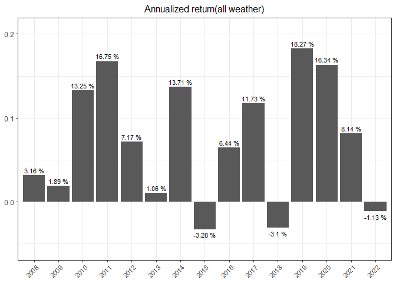

All weather & Global dynamic asset allocation strategy
================

Comparing all weather portfolio strategy by Ray Dalio with Global
dynamic asset allocation
strategy.(reference:<https://github.com/hyunyulhenry/GDAA>)

## All weather portfolio by Ray Dalio

Asstet allocation that is supposed to be able to weather any economic
storm(inflation, low economic growth, etc), manage risk exposure, and
make steady returns over the long term.

The all weather portfolio asset allocation consists of 40% US long-term
bonds, 30% US\_stock ETF, 15% US intermediate-term bonds, 7.5% Gold ETF,
and 7.5% Commodity ETF. And this strategy makes rebalancing annually.

### Download ETF price data and data cleansing

``` r
ticker = c('VTI', # All US stocks
           'TLT', # US long-term bonds
           'IEF', # US intermediate-term bonds
           'GLD', # Gold ETf
           'DBC'  # Commodities ETF
           
)
getSymbols(ticker, src = 'yahoo')
```

    ## [1] "VTI" "TLT" "IEF" "GLD" "DBC"

``` r
# Extracting adjusted prices and binding
prices = do.call(cbind, lapply(ticker, function(x) Ad(get(x)))) %>% setNames(ticker)

# Calculating daily returns
rets = Return.calculate(prices) %>% na.omit() %>% window(., start = '2008-01-02')
```

### Correlation Plot

``` r
cor(rets) %>% corrplot(method = 'color', type = 'upper',
                       addCoef.col = 'black', number.cex = 0.7,
                       tl.cex = 0.6, tl.srt = 45, tl.col = 'black',
                       col = colorRampPalette(c('blue', 'white', 'red'))(200),
                       mar = c(0, 0, 0.5, 0))
```

<!-- -->

### Prices trend

<!-- -->

### Backtesting with ‘Return.portfolio’ function

``` r
portfolio_all_g = Return.portfolio(R = rets, weights = c(0.3, 0.4, 0.15, 0.075, 0.075),
                                   rebalance_on = 'years', verbose = T)

# Calculating turnover
Port_all_turnover = xts(rowSums(abs(portfolio_all_g$BOP.Weight - 
                                  stats::lag(portfolio_all_g$EOP.Weight)),
                                  na.rm = T), order.by = index(portfolio_all_g$BOP.Weight))

# Suppose trading fee would be 0.3% for each trading
fee = 0.003

# Calculating net returns reflecting trading fee
Port_all_net = portfolio_all_g$returns - (Port_all_turnover * fee)

names(Port_all_net) = 'Returns_allweather'
```

### Backtesting results

<!-- -->

<!-- -->

### Summarization(All weather)

|             | Cummulative\_return | Annualized\_return | Max\_drawdown | Annualized\_std |
| ----------- | ------------------: | -----------------: | ------------: | --------------: |
| All Weather |            1.500165 |          0.0761437 |       0.14482 |       0.0760562 |

Table1: Summarization(All weather

## GDAA(Global Dynamic Asset Allocation) Strategy

1.  Choose 5 ETFs with high returns in the past 3\~12 months among 10
    global ETFs

2.  Make minimum variance portfolio with chosen 5 ETFs with minimum
    weights 10% and maximum weights 30% constraints

3.  Rebalance portfolio monthly

### Download ETF price data and data cleansing

``` r
ticker = c('VTI', # All US stocks
           'IEV', # European stocks
           'EWJ', # Japan stocks
           'EEM', # Emerging markets stocks
           'TLT', # US long-term bonds
           'IEF', # US intermediate-term bonds
           'IYR', # US Reits ETF
           'RWX', # Global Reits ETF 
           'GLD', # Gold ETF
           'DBC'  # Commodities ETF
)

getSymbols(ticker, src = 'yahoo')
```

    ##  [1] "VTI" "IEV" "EWJ" "EEM" "TLT" "IEF" "IYR" "RWX" "GLD" "DBC"

``` r
# Extracting adjusted prices and binding
prices = do.call(cbind, lapply(ticker, function(x) Ad(get(x)))) %>% setNames(ticker)

# Calculating daily returns
rets = Return.calculate(prices) %>% na.omit()
```

### Correlation plot

``` r
cor(rets) %>% corrplot(method = 'color', type = 'upper',
                       addCoef.col = 'black', number.cex = 0.7,
                       tl.cex = 0.6, tl.srt = 45, tl.col = 'black',
                       col = colorRampPalette(c('blue', 'white', 'red'))(200),
                       mar = c(0, 0, 0.5, 0))
```

<!-- -->

### Prices trend

<!-- -->

### Portfolio structuring

``` r
# Extracting indices of end of each month
ep = endpoints(rets, on = 'months')

# Create list to save each month's weight 
weights = list()

# Setting lookback period as 12
lookback = 12

# Setting initial weight as 0
wt_zero = rep(0, 10) %>% setNames(colnames(rets))

# Code for calculating weights at the end of past each month
for (i in (lookback + 1) : length(ep)) {
  
  # Calculating momentum(cummulative returns for each stock in the past 3 ~ 12 months      and making rank) 
  sub_ret = lapply(3 : 12, function(x) {
    scale(rank(Return.cumulative(rets[c(ep[i - x] : ep[i]), ] )))
  })
    
  # Choose 5 stocks with high returns, 'rank' function imposes rank with ascending         order 
  K = (rank(- apply(do.call(cbind, sub_ret), 1, sum), ties.method = 'first') <= 5)
  
  # Make Var-Cov matrix for 5 chosen stocks' returns 
  covmat = cov(rets[c(ep[i - 12] : ep[i]), K])
  
  wt = wt_zero
  
  # Create minimum variance portfolio with weight constraints(max = 0.3, min = 0.1)
  wt[K] = optimalPortfolio(covmat, control = list(type = 'minvol', 
                                                  constraint = 'user',
                                                  LB = rep(0.10, 5),
                                                  UB = rep(0.30, 5)))
  
  # Saving calculated weights at the end of the each month on 'weights' list
  weights[[i]] = xts(t(wt), order.by = index(rets[ep[i]]))
}

weights = do.call(rbind, weights)
```

### Backtesting with ‘Return.portfolio’ function

``` r
portfolio_gdaa_g = Return.portfolio(R = rets, weights,
                             rebalance_on = 'months',
                             verbose = T)

# Calculating turnover
Port_gdaa_turnover = xts(rowSums(abs(portfolio_gdaa_g$BOP.Weight - 
                                       stats::lag(portfolio_gdaa_g$EOP.Weight)),
                            na.rm = T), order.by = index(portfolio_gdaa_g$BOP.Weight))

# Suppose trading fee would be 0.3% for each trading
fee = 0.003

# Calculating net returns reflecting trading fee
Port_gdaa_net = portfolio_gdaa_g$returns - (Port_gdaa_turnover * fee)

names(Port_gdaa_net) = 'Returns_gdaa'
```

### Backtesting results

<!-- -->

<!-- -->

### Dynamics of weights

|            |       VTI |       IEV |       EWJ | EEM |       TLT | IEF |       IYR |       RWX |       GLD |       DBC |
| ---------- | --------: | --------: | --------: | --: | --------: | --: | --------: | --------: | --------: | --------: |
| 2017-08-31 | 0.3000000 | 0.1000000 | 0.2000000 | 0.1 | 0.0000000 | 0.0 | 0.0000000 | 0.0000000 | 0.3000000 | 0.0000000 |
| 2017-09-29 | 0.3000000 | 0.1000000 | 0.3000000 | 0.1 | 0.0000000 | 0.0 | 0.0000000 | 0.2000000 | 0.0000000 | 0.0000000 |
| 2017-10-31 | 0.3000000 | 0.1058332 | 0.3000000 | 0.1 | 0.0000000 | 0.0 | 0.0000000 | 0.0000000 | 0.0000000 | 0.1941668 |
| 2017-11-30 | 0.3000000 | 0.1012613 | 0.2915770 | 0.1 | 0.0000000 | 0.0 | 0.0000000 | 0.0000000 | 0.0000000 | 0.2071617 |
| 2017-12-29 | 0.3000000 | 0.1126803 | 0.2980159 | 0.1 | 0.0000000 | 0.0 | 0.0000000 | 0.0000000 | 0.0000000 | 0.1893038 |
| 2018-01-31 | 0.3000000 | 0.1037270 | 0.2967852 | 0.1 | 0.0000000 | 0.0 | 0.0000000 | 0.0000000 | 0.0000000 | 0.1994878 |
| 2018-02-28 | 0.3000000 | 0.1036822 | 0.1963178 | 0.1 | 0.0000000 | 0.0 | 0.0000000 | 0.0000000 | 0.0000000 | 0.3000000 |
| 2018-03-29 | 0.1678509 | 0.0000000 | 0.1321491 | 0.1 | 0.0000000 | 0.0 | 0.0000000 | 0.3000000 | 0.0000000 | 0.3000000 |
| 2018-04-30 | 0.1314966 | 0.0000000 | 0.1685034 | 0.1 | 0.0000000 | 0.0 | 0.0000000 | 0.3000000 | 0.0000000 | 0.3000000 |
| 2018-05-31 | 0.1338967 | 0.0000000 | 0.1661033 | 0.1 | 0.0000000 | 0.0 | 0.0000000 | 0.3000000 | 0.0000000 | 0.3000000 |
| 2018-06-29 | 0.1000000 | 0.0000000 | 0.1000000 | 0.0 | 0.0000000 | 0.0 | 0.2037792 | 0.2962208 | 0.0000000 | 0.3000000 |
| 2018-07-31 | 0.1000000 | 0.1000000 | 0.0000000 | 0.0 | 0.0000000 | 0.0 | 0.2507956 | 0.2492044 | 0.0000000 | 0.3000000 |
| 2018-08-31 | 0.1641876 | 0.0000000 | 0.0000000 | 0.0 | 0.3000000 | 0.0 | 0.1000000 | 0.2112468 | 0.0000000 | 0.2245655 |
| 2018-09-28 | 0.1057658 | 0.0000000 | 0.1000000 | 0.0 | 0.0000000 | 0.3 | 0.2192041 | 0.0000000 | 0.0000000 | 0.2750301 |
| 2018-10-31 | 0.1420543 | 0.0000000 | 0.0000000 | 0.0 | 0.0000000 | 0.3 | 0.1360428 | 0.0000000 | 0.3000000 | 0.1219029 |
| 2018-11-30 | 0.1396584 | 0.0000000 | 0.0000000 | 0.0 | 0.1964447 | 0.3 | 0.1000000 | 0.0000000 | 0.2638968 | 0.0000000 |
| 2018-12-31 | 0.0000000 | 0.0000000 | 0.0000000 | 0.0 | 0.2027641 | 0.3 | 0.1000000 | 0.1372323 | 0.2600036 | 0.0000000 |
| 2019-01-31 | 0.0000000 | 0.0000000 | 0.0000000 | 0.0 | 0.2083369 | 0.3 | 0.1000000 | 0.1447301 | 0.2469331 | 0.0000000 |
| 2019-02-28 | 0.1418585 | 0.0000000 | 0.0000000 | 0.0 | 0.2200922 | 0.3 | 0.1000000 | 0.0000000 | 0.2380493 | 0.0000000 |
| 2019-03-29 | 0.1000000 | 0.0000000 | 0.0000000 | 0.0 | 0.3000000 | 0.3 | 0.1000000 | 0.2000000 | 0.0000000 | 0.0000000 |
| 2019-04-30 | 0.1972992 | 0.0000000 | 0.0000000 | 0.1 | 0.3000000 | 0.3 | 0.1027008 | 0.0000000 | 0.0000000 | 0.0000000 |
| 2019-05-31 | 0.0000000 | 0.0000000 | 0.0000000 | 0.0 | 0.2172962 | 0.3 | 0.1000000 | 0.2200059 | 0.1626979 | 0.0000000 |
| 2019-06-28 | 0.1681038 | 0.0000000 | 0.0000000 | 0.0 | 0.2448236 | 0.3 | 0.1000000 | 0.0000000 | 0.1870726 | 0.0000000 |
| 2019-07-31 | 0.1801248 | 0.0000000 | 0.0000000 | 0.0 | 0.2782811 | 0.3 | 0.1000000 | 0.0000000 | 0.1415941 | 0.0000000 |
| 2019-08-30 | 0.1974382 | 0.0000000 | 0.0000000 | 0.0 | 0.2559454 | 0.3 | 0.1000000 | 0.0000000 | 0.1466164 | 0.0000000 |
| 2019-09-30 | 0.2165917 | 0.0000000 | 0.0000000 | 0.0 | 0.2409689 | 0.3 | 0.1000000 | 0.0000000 | 0.1424395 | 0.0000000 |
| 2019-10-31 | 0.0000000 | 0.0000000 | 0.1661671 | 0.0 | 0.3000000 | 0.0 | 0.1000000 | 0.2782457 | 0.1555872 | 0.0000000 |
| 2019-11-29 | 0.1665983 | 0.0000000 | 0.1979524 | 0.0 | 0.3000000 | 0.0 | 0.1000000 | 0.0000000 | 0.2354493 | 0.0000000 |
| 2019-12-31 | 0.1000000 | 0.1035459 | 0.2542423 | 0.0 | 0.0000000 | 0.0 | 0.2422119 | 0.0000000 | 0.3000000 | 0.0000000 |
| 2020-01-31 | 0.2916099 | 0.1368043 | 0.0000000 | 0.0 | 0.3000000 | 0.0 | 0.1000000 | 0.0000000 | 0.1715858 | 0.0000000 |
| 2020-02-28 | 0.3000000 | 0.0000000 | 0.0000000 | 0.0 | 0.1954129 | 0.3 | 0.1000000 | 0.0000000 | 0.1045871 | 0.0000000 |
| 2020-03-31 | 0.1000000 | 0.0000000 | 0.2046344 | 0.0 | 0.2096469 | 0.3 | 0.0000000 | 0.0000000 | 0.1857187 | 0.0000000 |
| 2020-04-30 | 0.1000000 | 0.0000000 | 0.1835565 | 0.0 | 0.2304618 | 0.3 | 0.0000000 | 0.0000000 | 0.1859817 | 0.0000000 |
| 2020-05-29 | 0.1000000 | 0.0000000 | 0.1863173 | 0.0 | 0.2307676 | 0.3 | 0.0000000 | 0.0000000 | 0.1829151 | 0.0000000 |
| 2020-06-30 | 0.1279612 | 0.0000000 | 0.0000000 | 0.1 | 0.2465920 | 0.3 | 0.0000000 | 0.0000000 | 0.2254468 | 0.0000000 |
| 2020-07-10 | 0.1206065 | 0.0000000 | 0.0000000 | 0.1 | 0.2364305 | 0.3 | 0.0000000 | 0.0000000 | 0.2429630 | 0.0000000 |

Table2: Weights

### Summarization(GDAA)

|      | Cummulative\_return | Annualized\_return | Max\_drawdown | Annualized\_std |
| ---- | ------------------: | -----------------: | ------------: | --------------: |
| GDAA |            1.466815 |          0.0778441 |     0.1631826 |       0.1063875 |

Table3: Summarization(GDAA)

## All weather vs GDAA

Compare results of both strategies

``` r
portfolios = na.omit(cbind(Port_all_net, Port_gdaa_net)) %>% setNames(c('All weather', 'GDAA'))

charts.PerformanceSummary(portfolios, main = 'All weather vs GDAA')
```

<!-- -->

### Summarization(All Weather vs GDAA)

|             | Annualized\_return | Cummulative\_return | Max\_drawdown | Annualized\_std |
| ----------- | -----------------: | ------------------: | ------------: | --------------: |
| All Weather |          0.0761437 |            1.500165 |     0.1448200 |       0.0760562 |
| GDAA        |          0.0778441 |            1.466815 |     0.1631826 |       0.1063875 |
