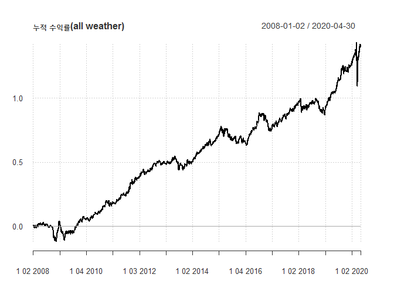
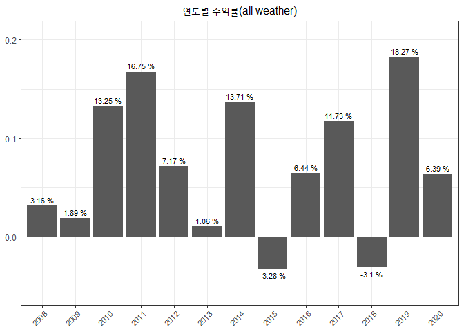
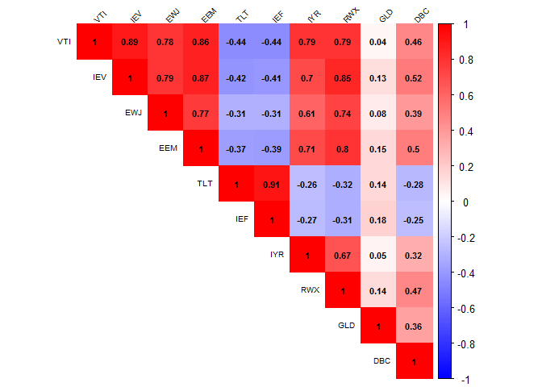
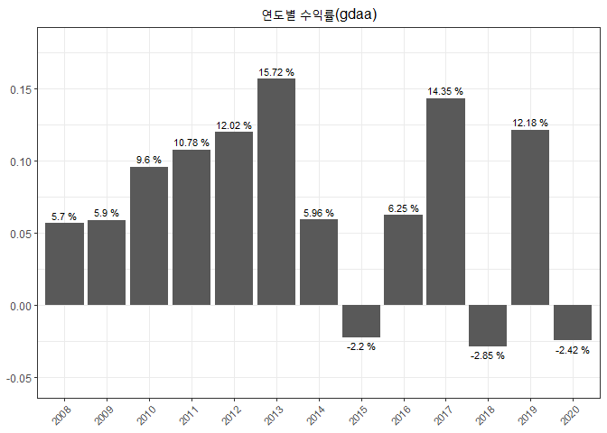
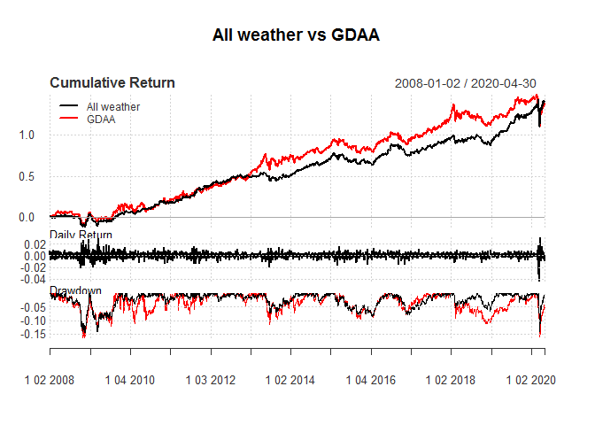

All weather & Global dynamic asset allocation 전략
================

레이달리오의 all weather 포트폴리오 전략과 Global dynamic asset allocation 전략에 대한 벡테스트 결과를 비교 벡테스팅 방법 및 코드는 <https://github.com/hyunyulhenry/GDAA> 을 참조

### 레이달리오의 all weather 포트폴리오

인플레이션, 저성장 등의 가능한 경제상황에 대체로 대응할 수 있게 고안된 포트폴리오. 미 전체 주식 종목에 대한 ETF 30%, 미 장기채 ETF 40%, 미 중기채 ETF 15%, 금 ETF 7.5%, 원자재 ETF 7.5%로 구성되며 리밸런싱은 매년 수행

#### ETF 가격정보 다운로드 및 데이터 정리

``` r
ticker = c('VTI', # 미국 상장 주식 전체(시가 가중평균)
           'TLT', # 미국 장기 국채
           'IEF', # 미국 중기 국채
           'GLD', # 금
           'DBC' # 원자재
           
)
getSymbols(ticker, src = 'yahoo')
```

    ## [1] "VTI" "TLT" "IEF" "GLD" "DBC"

``` r
# 수정 주가만 뽑아서 묶기
prices = do.call(cbind, lapply(ticker, function(x) Ad(get(x)))) %>% setNames(ticker)

# 일별 수익률 계산
rets = Return.calculate(prices) %>% na.omit() %>% window(., start = '2008-01-02')
```

#### 자산별 상관관계

``` r
cor(rets) %>% corrplot(method = 'color', type = 'upper',
                       addCoef.col = 'black', number.cex = 0.7,
                       tl.cex = 0.6, tl.srt = 45, tl.col = 'black',
                       col = colorRampPalette(c('blue', 'white', 'red'))(200),
                       mar = c(0, 0, 0.5, 0))
```


#### Return.portfolio 함수를 통한 백테스트

``` r
portfolio_all_g = Return.portfolio(R = rets, weights = c(0.3, 0.4, 0.15, 0.075, 0.075),
                                   rebalance_on = 'years', verbose = T)

# 회전율 계산
Port_all_turnover = xts(rowSums(abs(portfolio_all_g$BOP.Weight - 
                                  stats::lag(portfolio_all_g$EOP.Weight)),
                                  na.rm = T), order.by = index(portfolio_all_g$BOP.Weight))

# 매 거래시 수수료가 0.3%라 가정
fee = 0.003

# 수익률을 반영한 순수익 계산
Port_all_net = portfolio_all_g$returns - (Port_all_turnover * fee)

names(Port_all_net) = 'Returns_allweather'
```

#### 백테스트 결과





#### 결과 요약(All weather)

|             | 연평균수익률 | 누적수익률 |  최대낙폭 | 연평균표준편차 |
|-------------|:------------:|:----------:|:---------:|:--------------:|
| All Weather |   0.0708375  |  1.296779  | 0.1448199 |    0.0759205   |

### GDAA(Global Dynamic Asset Allocation) 전략을 통한 포트폴리오

아래와 같은 방식으로 포트폴리오를 구성

1.  글로벌 10개 자산 etf 중 과거 3~12개월 수익률이 높은 5개 etf를 선택

2.  개별 투자비중은 최소 10%, 최대 30% 제약 조건을 두고 최소분산 포트폴리오를 구성

3.  매월 리밸런싱 실시

#### ETF 가격정보 다운로드 및 데이터 정리

``` r
ticker = c('VTI', # 미국 상장 주식 전체(시가 가중평균)
           'IEV', # 유럽 주식
           'EWJ', # 일본 주식
           'EEM', # 이머징 주식
           'TLT', # 미국 장기 국채
           'IEF', # 미국 중기 국채
           'IYR', # 미국 리츠
           'RWX', # 글로벌 리츠
           'GLD', # 금
           'DBC' # 원자재
)

getSymbols(ticker, src = 'yahoo')
```

    ##  [1] "VTI" "IEV" "EWJ" "EEM" "TLT" "IEF" "IYR" "RWX" "GLD" "DBC"

``` r
# 수정 주가만 뽑아서 묶기
prices = do.call(cbind, lapply(ticker, function(x) Ad(get(x)))) %>% setNames(ticker)

# 일별 수익률 계산
rets = Return.calculate(prices) %>% na.omit()
```

#### 자산별 상관관계

``` r
cor(rets) %>% corrplot(method = 'color', type = 'upper',
                       addCoef.col = 'black', number.cex = 0.7,
                       tl.cex = 0.6, tl.srt = 45, tl.col = 'black',
                       col = colorRampPalette(c('blue', 'white', 'red'))(200),
                       mar = c(0, 0, 0.5, 0))
```



#### 포트폴리오 구성

``` r
# 매월 말일 위치 구하기(리밸런싱 주기가 매월이므로)
ep = endpoints(rets, on = 'months')

# 매월 투자비중을 저장할 빈 리스트 생성
weights = list()

# lookback기간을 12개월로 설정
lookback = 12

# 초기 투자비중 값을 0으로 설정
wt_zero = rep(0, 10) %>% setNames(colnames(rets))

# 과거의 매월 말일 시점마다 포트폴리오의 비중을 구하는 코드
for (i in (lookback + 1) : length(ep)) {
  
  # 과거 3~12 개월 자료를 이용하여 모멘텀 계산(직전 과거 3~12개월간 누적수익률 각각구한 뒤 순위를 매김) 
  sub_ret = lapply(3 : 12, function(x) {
    scale(rank(Return.cumulative(rets[c(ep[i - x] : ep[i]), ] )))
  })
    
  # 수익률이 좋은 5개의 자산 추리기, rank함수는 숫자가 낮은것에서부터 순위를 매김
  K = (rank(- apply(do.call(cbind, sub_ret), 1, sum), ties.method = 'first') <= 5)
  
  # 수익률 좋은 5개 자산에 대한 공분산 행렬 생성 
  covmat = cov(rets[c(ep[i - 12] : ep[i]), K])
  
  wt = wt_zero
  
  # 최소 비중이 10% 최대 비중이 30%인 제약 하에서 최소 분산 포트폴리오 투자비중 구하기
  wt[K] = optimalPortfolio(covmat, control = list(type = 'minvol', 
                                                  constraint = 'user',
                                                  LB = rep(0.10, 5),
                                                  UB = rep(0.30, 5)))
  
  # 각 시점별 계산된 투자비중을 weights 리스트에 저장
  weights[[i]] = xts(t(wt), order.by = index(rets[ep[i]]))
}

weights = do.call(rbind, weights)
```

#### Return.portfolio 함수를 통한 백테스트

``` r
portfolio_gdaa_g = Return.portfolio(R = rets, weights,
                             rebalance_on = 'months',
                             verbose = T)

# 회전율 계산
Port_gdaa_turnover = xts(rowSums(abs(portfolio_gdaa_g$BOP.Weight - 
                                       stats::lag(portfolio_gdaa_g$EOP.Weight)),
                            na.rm = T), order.by = index(portfolio_gdaa_g$BOP.Weight))

# 매 거래시 수수료가 0.3%라 가정
fee = 0.003

# 수익률을 반영한 순수익 계산
Port_gdaa_net = portfolio_gdaa_g$returns - (Port_gdaa_turnover * fee)

names(Port_gdaa_net) = 'Returns_gdaa'
```

#### 백테스트 결과




#### 결과 요약(GDAA)

|      | 연평균수익률 | 누적수익률 |  최대낙폭 | 연평균표준편차 |
|------|:------------:|:----------:|:---------:|:--------------:|
| GDAA |   0.0719711  |  1.249483  | 0.1631826 |    0.1068542   |

### All weather vs GDAA

레이 달리오의 All Weather 포트폴리오와 GDAA 전략을 통한 포트폴리오의 결과를 비교

``` r
portfolios = na.omit(cbind(Port_all_net, Port_gdaa_net)) %>% setNames(c('All weather', 'GDAA'))

charts.PerformanceSummary(portfolios, main = 'All weather vs GDAA')
```



#### 결과 요약(All Weather vs GDAA)

|             | 연평균수익률 | 누적수익률 |  최대낙폭 | 연평균표준편차 |
|-------------|:------------:|:----------:|:---------:|:--------------:|
| All Weather |   0.0708375  |  1.296779  | 0.1448199 |    0.0759205   |
| GDAA        |   0.0719711  |  1.249483  | 0.1631826 |    0.1068542   |
